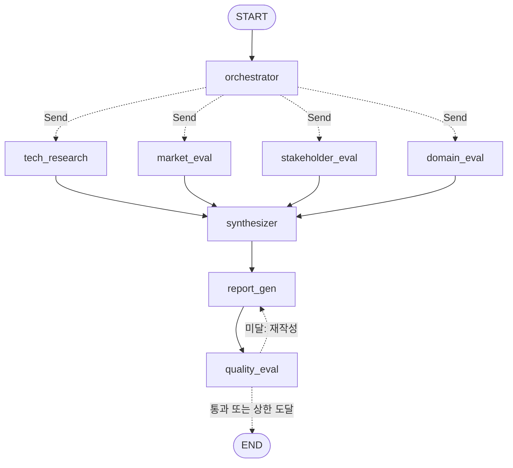

# KV Cache 최적화 기술 다관점 평가

판교 9반 5조 · SKALA

# Subject
본 프로젝트는 KV cache 최적화 기술을 소프트웨어, 하드웨어 두 진영에서 선정하여,
시장·이해관계자·도메인 관점에서 평가하는 Orchestrator-Workers 기반으로 설계/개발 하는
프로젝트 임.


## Overview
- Objective : 하나의 기술을 복수 관점에서 비교 평가
- Pattern : Orchestrator-Workers - 기술 성격에 따라 관점별로 필요한 조사 범위와
  깊이가 달라, 어떤 워커를 몇 번 어떻게 나눠 부를지를 계획 단계에서 정하는 방식이
  적합하다고 판단
- 동적 처리 : 워커로 가는 고정 엣지 없이 Orchestrator가 세운 계획에 따라 `Send`로
  task를 분배하므로, 실행마다 호출되는 워커의 종류·개수·지시가 달라짐. 실패한
  task는 재시도 후 제외하고, 보고서는 품질 평가에 미달하면 피드백과 함께 재작성


## Selected Technologies
- SW : **DeepSeek-V2 (Multi-head Latent Attention, MLA)** — Key-Value를 저랭크
  latent 벡터로 공동 압축해 KV 캐시를 93.3% 줄이는 어텐션 구조. 양자화 계열
  (TurboQuant, KIVI)이 매 스텝 양자화·역양자화 연산을 추가하는 것과 달리 압축을
  아키텍처에 내재화했고, 실제 서비스 환경의 실측 처리량 근거가 있어 선정
  (추정 TRL 8)
- HW : **ITME (Inference Tiered Memory Expansion)** — CXL 하이브리드 메모리와
  SSD-backed 원격 메모리를 GPU 서버가 RDMA로 접근하는 계층형 메모리 확장 구조.
  KV 캐시를 줄이는 SW 접근과 달리 GPU 외부 메모리 용량 자체를 늘리는 방향이라
  DeepSeek-V2와 상호 보완적이고, 특수 하드웨어를 전제로 하는 PIM/CXL보다 표준에
  가까운 구성이라 재현성·상용화 경로가 명확해 선정 (추정 TRL 5)


## Features
- PDF 자료 기반 정보 추출 : 선정 기술 원문 2건, 대조 기술(TurboQuant, InfiniGen)
  2건, 관련 논문 11건 등 총 15건을 인덱싱. 대조 기술은 별도 컬렉션으로 분리해
  "왜 이 대안을 선택하지 않았는지"를 근거 기반으로 비교
- 알고리즘 기반 PDF 파서 : Vision 모델 없이 PyMuPDF/pdfplumber 기하 분석으로
  Figure/Table 분리, 2단 컬럼 읽기 순서 재정렬, 수식·하이픈 정규화
  (실패 시 `PDFPlumberLoader`로 폴백). 1200자 단위, 200자 겹침으로 청킹
- 웹검색 기반 시장성·이해관계자 반응 조사 (TavilySearch)
- 기술성숙도 평가 : NASA TRL 9단계 척도로 추정하고, 공개 정보 기반 추정임을 명시
- 동적 계획과 커버리지 보장 : Orchestrator가 task를 계획하면, 네 관점 각각에서
  SW와 HW가 모두 조사되는지 코드로 확인하고 빠진 부분은 기본 task로 보완.
  계획 생성이 실패하면 기본 계획으로 대체
- 실패 대응 : 워커는 task별로 최대 2회 시도하고, 끝까지 실패한 task는 종합에서
  제외한 뒤 그 사실을 자료 한계로 보고서에 전달. 병렬 워커의 웹검색은 한 번에
  하나씩 보내고, 요청 과다(429) 응답이 오면 간격을 두고 다시 시도
- 확증 편향 방지 전략 : 워커와 종합 단계 모두 우열 판정 없이 한계와 반대 근거를
  함께 쓰도록 프롬프트를 설계하고, 종합에서는 관점 간 일치·상충 지점을 병렬 서술.
  각 워커가 실제로 검색한 출처만 `references`로 넘겨 LLM이 자료를 지어내지 않게 함
- 보고서 품질 평가 : Groundedness, 중립성, 편향 통제, 관점 커버리지 4개 항목을
  코드 검사(지어낸 URL, 출처 다양성, 필수 소제목)와 LLM 판정으로 평가하고, 분량
  (PDF 10쪽 이내)을 코드로 검사. 모두 통과해야 통과이며, 미달이면 사유를 피드백으로
  넘겨 최대 2회 재작성
- 보고서 분량 맞춤 : 보고서를 PDF로 저장할 때 글자 크기를 10.5pt에서 9pt까지 줄여
  보고, 그래도 10쪽을 넘으면 제목 구조·수치·출처를 유지한 채 LLM으로 최대 3회 압축


## Tech Stack
- Framework : LangGraph (LangChain `init_chat_model`)
- LLM/Generator : `gpt-5.6-terra` (Orchestrator, Synthesizer, 보고서 생성·압축),
  `gpt-5.6-luna` (워커 4종)
- LLM/Judge : `gpt-5.6-terra` (보고서 품질 평가)
- Retrieval : Chroma - Hit Rate@K, MRR 미측정 (코사인 유사도, 메인 풀 상위 8개 /
  대조 기술 풀 상위 4개)
- Embedding : BGE-M3 - 긴 문맥·다국어 지원, MIT License


## Agents
- Orchestrator : 두 기술의 성격을 보고 어떤 워커를 몇 번, 무엇에 집중해서 부를지
  계획하고 `Send`로 task를 분배
- 기술 조사 워커 (`tech_research`) : 원문 RAG와 대조 기술 RAG로 기술 개요, 적용
  범위, 한계, TRL 정리
- 시장 평가 워커 (`market_eval`) : 웹검색으로 시장 규모·성장성, 상용화·채택 현황,
  생태계 조사
- 이해관계자 평가 워커 (`stakeholder_eval`) : RAG와 웹검색으로 경쟁사, 도입
  기업·개발자, 투자 업계의 시각 정리
- 도메인 평가 워커 (`domain_eval`) : RAG와 웹검색으로 데이터센터·클라우드에서의
  처리 가능 규모, 비용 절감 효과, 제약 정리
- Synthesizer : 실패한 task를 제외 판정하고, 관점별 결과를 일치·상충 지점이
  드러나게 종합
- 보고서 생성 (`report_gen`) : 관점별 결과와 종합 의견을 정해진 형식의 보고서로
  작성하고 10쪽 이내로 맞춰 md와 PDF로 저장. 재작성 시 이전 보고서와 피드백을
  함께 받음
- 품질 평가 (`quality_eval`) : 4개 항목과 분량으로 보고서를 판정하고 통과, 재작성,
  종료 중 하나를 결정


## State Schema
- 제어 vs 페이로드 분리 : 분배와 실패 대응에 쓰는 `tasks`(상태, 시도 횟수, 에러)와
  워커 결과물인 `results`(본문, 출처)를 같은 `task_id`로 나눠 저장함. 덕분에
  라우팅과 제외 판정은 본문을 읽지 않고 `tasks`만 보고 할 수 있음.
- 관측성 위치 : 계획·재시도·제외·재작성 같은 결정과 그 사유는 `decisions`에 한
  줄씩 남기고, 프롬프트나 검색 결과 같은 상세는 State가 아닌 LangSmith 트레이스에서
  확인함.
- 지속성 비용 : 검색 청크와 Tavily 원문은 워커의 지역 변수로만 쓰고 State에는 최종
  본문과 출처만 넣음. `results`와 `review`는 덮어쓰는 방식이고 `decisions`는
  재시도·재작성 상한만큼만 늘어나 체크포인트가 계속 커지지 않음. 대화 이력
  (`messages`)은 두지 않음.
- 상관 : 실행마다 만든 `run_id`를 State에 넣고, 체크포인트 `thread_id`와 LangSmith
  실행 이름에도 같은 값을 넣어 한 번의 실행을 체크포인트와 트레이스 양쪽에서 같은
  값으로 찾을 수 있음.
- 재개/복구 : 체크포인터가 State를 저장하고, task별 `status`·`attempts`·`error`로
  어디까지 끝났고 무엇이 실패했는지 판단함. 끝까지 실패한 task는 `excluded`로 바꿔
  종합에서 빼고, 그 사실을 자료 한계로 보고서에 전달함.
- 동시 처리 : 병렬 워커가 쓰는 `tasks`와 `results`는 키 단위 병합 리듀서를,
  `decisions`는 이어 붙이는 리듀서를 가짐. 워커마다 `task_id`가 달라 같은 키를
  동시에 쓰는 일이 없음.
- 종료 보장 : 워커는 `MAX_ATTEMPTS`(2)까지만 시도하고 그 뒤에는 실패로 반환함.
  되돌아가는 엣지는 `quality_eval → report_gen` 하나뿐이며, `MAX_REVISIONS`(2)를
  넘으면 품질 기준에 미달이어도 종료함.


## Architecture

점선은 실행 시점에 결정되는 경로. 각 워커는 계획에 따라 0회 이상 호출됨.


## Directory Structure
```
├── data/                                    # 문서 풀
│   ├── raw/                                 # 원문 PDF 15건 (선정 기술 2 + 대조 기술 2 + 관련 논문 11)
│   ├── extracted/                           # PDF 파서 추출 결과 (논문별 폴더)
│   └── processed/                           # 정제·조립된 논문 본문(md)과 이미지
├── agents/                                  # Agent 모듈
│   ├── orchestrator.py                      # 계획 수립, 커버리지 보완, 워커로 task 분배(Send)
│   ├── tech_research.py                     # 기술 조사 워커 (RAG, 대조 기술 비교, TRL)
│   ├── market_eval.py                       # 시장 평가 워커 (웹검색)
│   ├── stakeholder_eval.py                  # 이해관계자 평가 워커 (RAG + 웹검색)
│   ├── domain_eval.py                       # 도메인 평가 워커 (RAG + 웹검색)
│   ├── synthesis.py                         # Synthesizer (실패 task 제외, 관점별 결과 종합)
│   ├── report_gen.py                        # 보고서 생성 (md, pdf 저장)
│   ├── report_fit.py                        # 보고서 분량 맞춤 (10쪽 초과 시 LLM 압축)
│   ├── report_pdf.py                        # 마크다운 보고서 → PDF 변환 (글자 크기 자동 축소)
│   ├── quality_eval.py                      # 보고서 품질 평가, 재작성 여부 결정
│   ├── worker_utils.py                      # 워커 공통: 모델 설정, RAG/웹검색, 재시도
│   ├── prompt_utils.py                      # 프롬프트 로더, 출처 추출, 웹검색 폴백·요청 과다 대응
│   └── tech_selector.py                     # 기본 기술명·도메인 상수
├── graph/                                   # 그래프
│   ├── state.py                             # State 정의 (Task, TaskResult, Decision, GraphState, ReportState)
│   └── build_graph.py                       # 노드 등록, 엣지 배선
├── rag/                                     # RAG 공통 모듈
│   ├── embeddings.py                        # BGE-M3 임베딩 생성
│   ├── base.py                              # 로딩 → 청킹 → 임베딩 → Chroma 인덱싱 → retriever 생성
│   ├── pdf.py                               # PDF 검색 체인, 원문·대조 기술 경로 목록
│   └── pdf_parser.py                        # 알고리즘 기반 논문 PDF 파서
├── prompts/                                 # 프롬프트 템플릿
│   ├── tech_research.txt                    # 기술 조사
│   ├── market_eval.txt                      # 시장 평가
│   ├── stakeholder_eval.txt                 # 이해관계자 평가
│   ├── domain_eval.txt                      # 도메인 평가
│   ├── synthesis.txt                        # 평가 종합 (미사용, 프롬프트는 synthesis.py에 있음)
│   └── report_gen.txt                       # 보고서 생성
├── outputs/                                 # 실행 결과 저장
│   ├── report.md                            # 평가 보고서 (마크다운)
│   ├── report.pdf                           # 평가 보고서 (PDF, 10쪽 이내)
│   ├── report_orchestrator_workers.md       # report.md와 같은 내용의 사본
│   └── graph.png                            # 그래프 이미지
├── tests/
│   ├── test_graph_smoke.py                  # 그래프 배선 스모크 테스트
│   └── test_rag_pdf.py                      # PDF 검색 체인·파서 단위 테스트
├── orchestrator_workers_specialized.ipynb   # 설계 검증용 프로토타입 노트북
├── app.py                                   # 실행 스크립트
├── requirements.txt                         # 의존성 목록
├── .env.example                             # API 키 템플릿
└── README.md
```


## Usage
```bash
pip install -r requirements.txt
cp .env.example .env   # OPENAI_API_KEY, TAVILY_API_KEY (선택: LANGSMITH_API_KEY)

# 전체 그래프 실행: 결과는 outputs/report.md, outputs/report.pdf
python app.py

# 그래프를 실행하지 않고 outputs/graph.png만 생성
python app.py --graph
```


## Contributors
- 박종문 : 보고서 평가 노드 구현
- 장나리 : Orchestrator-Workers 설계, Readme 작성
- 정서영 : Orchestrator 구현
- 한상현 : 기존 agent 워커로 변경
